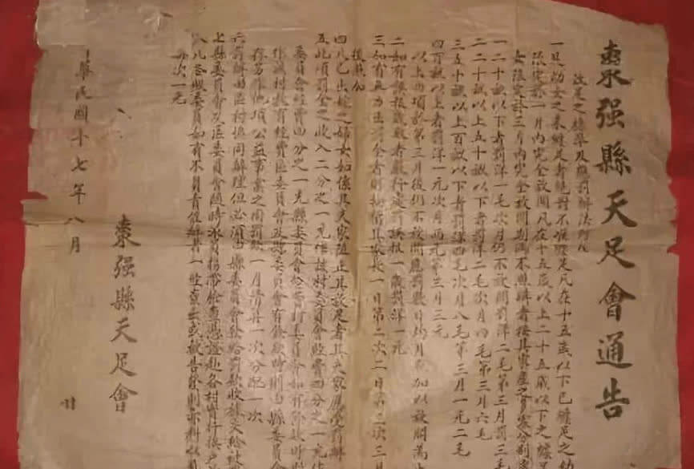
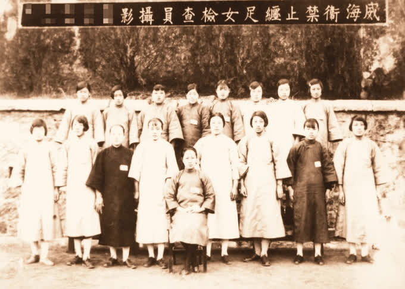
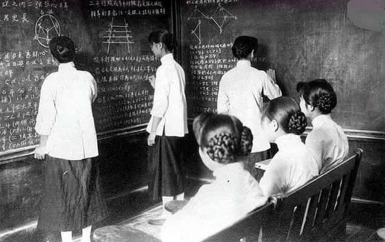

# 封建女性地位
## “三从四德”下缺失自由和地位卑微

    桃之夭夭，灼灼其华。
    之子于归，宜其室家。
    桃之夭夭，有蕡其实。
    之子于归，宜其家室。
    桃之夭夭，其叶蓁蓁。
    之子于归，宜其家人。

《诗经》中女性出现的场景多为娘家与婆家，无论是出嫁前还是出嫁后，女性都是二门不出大门不迈，要么娘家，要么婆家，没有第三选择。娘家是指已婚妇人的出生成人之所，是少女时的家，是女子为人妇前的住所。古代女子需遵守“三从四德”“女子无才便是德”的说法，娘家教导女子成为淑女，遵守妇道，维护娘家形象，婆家检验女子是否具有妇德，是女子“施展所学”的地方。不管是娘家还是婆家，女性的生活是被安排的状态，没有自由，没有空间，生活的地方便只有闺阁那一亩三分地。为人妻前，遵从父母之命媒妁之言，娘家束缚她的思想；为人妻后，婆家延续对女性的管教，禁锢她的自由。

“桃之夭夭，灼灼其华。之子于归，宜其室家”，前半句桃花盛开，女子欢喜入夫家。桃花盛开的季节是在寒冬过后，古代未出嫁的女子要求遵守“三从四德”，大门不出，坐守闺阁，只有出嫁当天可以见到自己的夫婿，封建礼教遏制了女子出行的自由，选择的自由，为她们选择好了一切。此时，女子的欢喜究竟是嫁人的喜悦还是摆脱束缚，重见光明的兴奋，不得而知。而“桃之夭夭，有蕡其实。之子于归，宜其家室”讲述了对于女子最好的祝愿，希望女子能生儿育女，传宗接代。这是祝愿，也是对女子的要求，“不孝有三，无后为大”，可见，传宗接代是传统礼教赋予新婚妇女的另一副枷锁。女子除了要履行生儿育女的义务，更有添丁的苛求，如若不然，丈夫便可纳三妻四妾。女子的作用是充当家族开枝散叶的工具，她们没有选择的权利，只有履行的义务，女子在家庭的地位由生儿生女来决定。《桃夭》在极力赞美婚姻的美好时，却略带些讽刺，美好的场景竟是又一座坟墓的标志。

## 女性在人格与生活上的依附性
在《京华烟云》中，孙曼娘是一个典型的传统女子形象。她一生都为她的丈夫亚平活着，哪怕只是一个拥抱，她便认定了他是亚平的人，即使男人病重也毅然决然的嫁给了他，并在亚平死后，坚持着“生是曾家人，死是曾家鬼”的信念而守活寡，哪怕在其拥有了养子阿瑄后，又将生活重心放在了儿子身上，几乎没有真正的为自己独立的人格活过，始终将自己的人格依附在男人、家庭、孩子身上，更别说是生活了，恐怕自己一个人也是活不下去的。赫拉克利特说：“一个人的性格就是他的命运。”孙曼娘的悲剧就在于受到传统意识观念洗礼而丧失自我的依附性人格。

在《白鹿原》中，田小娥无疑也是命运悲惨的女性形象代表 ，她自小被卖给能做她爷爷的郭举人做小妾，为了摆脱这种水深火热的生活状态，她主动依附于黑娃，在黑娃出走之后，又将活下去的希望寄托于白孝文的身上。生活与命运对于田小娥是不公平的，但在寻找出路的过程中，她本能的选择了“男人”，这种对男性的依附性使得她从不相信在那样的时代能够靠自己的努力活下去，而事实也证明了，她最终还是没能找到一个护她一世周全的男人，最终悲惨死去。

# 近代女权思想的出现
随着新的社会经济成分出现，新的思想文化传入中国，先进知识分子对旧思想的摆脱，在这样的社会的大背景下女权作为争取民主的重要体现被重视，女权思想也随着女性解放运动不断地发展。

## 社会经济的发展
中国一直以来都是以**小农经济为主**，多是**自给自足**。这种以精耕细作为主的小农经济，进行生产主要依靠的是人的体力。男人和女人在体质和体力上确实存在自然差异，这就有了**男尊女卑**的反映，女性受世俗观念的影响更是被禁锢在了家中。

**民族资本主义的兴起和发展**，冲击着自给自足的小农经济，这种封闭腐朽落后的**自然经济被打破、瓦解**。以家庭为主的手工作坊因没有竞争优势不得不破产倒闭，原来在小作坊工作的工人为维持生计也只得去工厂工作，同时女性不再在作坊工作，也得去到工厂，这就女性走出家庭提供了条件。并且企业里上**出现工作强度**不太大但需要很细致地进行，**适合女性工人来进行生产的一类工作**。由于工作岗位对女性的需求，女性大量的加入工人队伍，女性工人越来越多。因此，五四时期女权意识的出现得益于民族资本主义经济快速发展，女性也和男性一样工作，经济地位提高，思想得到解放，经济的发展影响了社会观念，当时的一些观念开始慢慢转变，这就为早期女权意识的出现创造了条件。

据统计，1894年甲午中日战争前，全国女工约3.5万人。 1915年据北京政府农商部的统计，女工发展到24.5万人，在全部工人中所占的比例为37.8%；到1920年，女工人数虽有所下降，为16.7万人，但是在全部工人中的比例则有所上升，达到了40.5%。20世纪二三十年代，女工人数进一步增长，尤以工业中心上海为著，20年代末上海女工已达12.6万人，占全部工人总数的56%。据1930年工商部调查，上海有成年男工97875人，成年女工120836人，女工是男工的1.2倍。

<figure>
  
  <figcaption>出自：来源《农商统计表》第九次</figcaption>
</figure>

<figure>
  
  <figcaption>继昌隆缫丝厂的女工</figcaption>
</figure>

## 西方“自然法权”和“天赋人权”思潮的输入
中国社会经过1840年的鸦片战争，受到了极大的震动，中国传统文化遭遇了“数千年来未有之变局”，西方社会的各种思想伴随着坚船利炮和传教士的活动开始在中国传播，西方的法文化也开始影响近代中国。有学者指出：“**打破中国法文化封闭状态的急先锋，是近代来华的西方传教士**”。从1840年以来，西方传教士开始大量涌入中国，1876年在中国的新教传教士有473人，1889年达到1296人，到1910年超过了5000人。最为知名的是1887年英国传教士韦廉臣在上海创立了广学会，传教士们称要“**把中国人的思想开放起来**”，认为“他们所带来的信息，不仅可以解决中国道德和精神方面的问题，还能解决政治和经济方面的问题。”传教士们的活动影响了上至皇帝，下至黎民的许多人。他们通过广学会的翻译出版工作，介绍了伏尔泰、卢梭、孟德斯鸠、狄德罗等人的学说以及法律改革思想，宣传了**人权观念、平等观念、法制观念**，这在中国要求进步、要求认识外部世界、向西方寻求救国真理的知识分子中间产生了很大的共鸣，起到了思想启蒙的作用，为中国的变法维新运动提供了理论先导。

<figure>
  
  <figcaption>裨文女中师生合影</figcaption>
</figure>

1843年开始，陆续有传教士宣扬并办女学堂，裨文女中是由美国基督教公理会传教土裨治文与夫人格兰德女士在上海创办的，宋庆龄的母亲就在这个学校就读。

1874年，英国传教士约翰．麦克高望率先在厦门建立了 “天足会"，入会的妇女60人。1878（光绪四年）年英国的立德夫人，在上海也设立了“天足会”，并在无锡、苏州、扬州、镇江、南京等地设立分会。民国初期，天足会为表彰禁止妇女缠足、提倡妇女放足活动中的有功人员，奖励抵制缠足的先锋女性、开明丈夫和模范家族，特制作“天足会奖章”。“天足会奖章”，是反封建运动的历史物证，也是妇女解放运动的历史一页。

## 马克思主义思想的传入
五四时期的一些学者将马克思主义带入了中国，随着马克思主义在中国的传播，其中有关女性的思想也在中国传播开来，在五四运动的推动下，这种思想迅速传播并被人们所接受。人们开始关注到女性这个群体。在这时期，出现了一系列报道女性解放运动、解读女性内心、为女性争取权益和要求改变当下女性生活现状的报纸刊物，以专栏的形式针对女性相关话题与社会大众共同探讨。女性解放与反封建传统文化、传统伦理被放到了一起讨论，女权思想也被具体化为平等地接受教育、个人的婚恋自由、独立的人格进行社会交往、经济独立等。马克思主义女性解放思想在同中国实际相结合的实践中得到了广泛的传播及接受。

## 先进知识分子的推动
2019年4月30日，习近平总书记在纪念五四运动100周年大会上指出：“五四运动前后，我国一批先进知识分子和革命青年，在追求真理中传播新思想新文化，勇于打破封建思想的桎梏。”

早期维新派的代表人物郑观应就曾经指出：“民受生于天；天赋之以能力，使之博硕丰大，以遂其生，于是有民权焉。民权者，君不能夺之臣，父不能夺之子，兄不能夺之弟，夫不能夺之妇”。

现有研究多以《大同书》为康有为女性说的起始，对康有为女性说核心内容的概括亦几近陈词，然而依然有必要带着检讨去重新审视。现有共识是，康有为女性论的主张是“大同之世，天下为公，无有阶级，一切平等”纲领之下男女平等的具体表现。现有研究中往往梗概地将康有为女性思想的提炼为以下核心公式：“人权经天赋”的前提上，男女平等实为世界大同的条件，并且认为男女同为“天民”，故应平等地享有自己独立的“天权”。带着性别议题上社会性别或者男女平等的视角，今人目光往往投到男女皆为天民而均受天权之处即止。但实际上，在陈述完男女共享天权之后，康有为直接将男女同享天权的论点延伸至“国政”，认为既然男性以享有天权的人身可追求参与国家政治的公共事务，那么男性也不能压抑同享天权的女性在此的追求：“人之男身既知天与人权所在，而求与闻国政，亦何抑女子禳其权哉。女子亦何听得男子独擅其权，而不任其天职。”

李大钊同志率先将马克思主义带入中国，并把唯物史观用于女权思想，让马克思主义妇女理论在中国得到了传播并开始被接受，他为我国的女性解放探索做出了一个前所未有的道路。在他看来，要让女性真正地得到解放，就要联合各个阶层的女性，共同进行斗争，单靠部分人的力量是不足与顽固的封建势力进行斗争。必须联合起来进行社会革命以打破专制的封建社会制度，从而实现女性的彻底解放。

陈独秀曾他的文章中对“三纲五常”这一封建观念大肆鞭挞。他深入思考和分析了中国女性在谋求独立自主方面的问题，认为封建社会的女性只是男性的附属物，她们完全没有独立自主的意识，她们独立自主的权利早就被剥夺，独立自主的思想早就被纲常伦理给磨平。于是他倡导尊重个人独立自主的人格，女性要从对男性的依附中脱离出来。

鲁迅通过他的作品揭露封建社会中男女不平等的现象，严肃批判了当时社会中男性霸权对女性产生的压迫和伤害，控诉了诸多男女不平等行为，引发社会的强烈共鸣。

恽代英作为中国共产党人。在接受马克思主义理论的同时也对马克思主义妇女观有着深刻的理解，对于中国的女性权利问题，他有着自己的见解，并做了全面的系统的阐述。他强烈批判了“传宗接代”思想对中国女性的荼毒，女性完成沦为了生育的机器，没有了自主选择的权利。因此，恽代英指出女性的解放不仅仅是女性内部各阶层间的解放，更是整个社会对女性禁锢的一种打破。

# 女权思想的主要表现
受到西方女权思想影响的女性们开始为争取自身权利而进行抗争，在各个方面争取女性应有的权力和利益。五四时期，各位马克思主义学者以马克思主义思想为武器，向封建礼教进行挑战，揭露出封建礼教对中国女性的束缚，给予封建的女性思想以无情的抨击，提出当代女性要拥有独立人格，接受高等教育，参与政治事务管理，婚恋自主等主张，这都大大激发了女性的思想自觉。女性摆脱束缚、独立自主，勇于冲破封建礼教的牢笼，打破家庭对其的禁锢，步入社会中来实现自我的价值。

## 争取受教育权
在封建社会中，认为女子应该无才，女性不用学习文化知识，上学的都是男性，女性无权受教育，就算有部分女性能够接受教育，也是旧式教育。传统的旧式教育总是绕不开三纲五常、三从四德，一代又一代的根深蒂固。

近代女子学堂的开办就在新文化运动中艰难地开创起来，但上层社会人民生活的一个重要表现与欧美国家接轨，他们对女性的生活、权利、能力有了肯定和接受，并且愿意让其接受更深层次的教育，这类上层社会知识女性在不断解放思想的过程中逐渐形成一个重要群体——名媛淑女。

随着女子教育的振兴，使一批没有受教育权利和机会的妇女走出闺阁，接触社会，认识社会，为妇女参加政治、经济、文化活动，提高社会地位开辟了道路，也为妇女进一步接受新文化。新思想开辟了道路，也为妇女进一步接受新文化、新思想创造了条件。女性教育的发展孕育了中国知识女性群体，她们是妇女中最早具有女性意识的一部分，对妇女解放运动有重要的意义。

新文化运动以及之后女性自主性地在全国范围内倡导女权，却也只是在上层社会中适用，广大妇女仍是在艰辛地生活着和被压迫地存在着，她们没有受教育权，依旧需要为整个家庭奉献生命，而其家庭却并未重视其个性与人生。

<figure>
  
  <figcaption>《觉悟》，1920年8月29日，第4页</figcaption>
</figure>

## 争取婚姻自由权
如何争取婚姻自由也是在五四时期被热议的话题。在封建社会里，都是以男性为中心，女性是完全听从于丈夫的，妻子没有决断事物的权利，全凭丈夫做主，如果有违背丈夫的意愿，就可能会被丈夫抛弃。封建社会里男人还被允许有三妻四妾，这样一来女性的地位就更加低下了。女性在家庭中地位低下造就了其悲剧的命运。

五四时期，先进知识分子受西方文化的影响，对西方的自由婚姻观念十分推崇，致力于推动女性婚姻自由。他们反对包办婚姻，向封建婚姻发起了挑战。女性需要有自主选择的权利，尤其是在婚姻方面，不能再以“父母之命、媒妁之言”来束缚女性，剥夺她们婚姻自由的权利。中国的女性想要彻底的逃脱封建礼教的迫害，首先在婚姻方面就必须要获得自主的权利，婚姻是自己的事情就应该由自己做主，恋爱自由、婚姻自由，离婚和再婚自由，摆脱封建社会的守节守寡等封建思想的约束，这样女性的权益才能够真正地得到保障。

<figure>
  
  <figcaption>《觉悟》，1924年3月14日，第4页</figcaption>
</figure>

## 争取政治参与权
女作家王妙如创作的《女狱花》则以倡议女权为己任。小说中的女主人公沙雪梅痛恨让女子受苦的社会现实,读了斯宾塞的《女权篇》，立志要改变现状。她所受的是激进女权主义的影响,以较为激烈的方式 进行提倡 男女平等和女子参与政权。她挑战的是整个男性社会,她将男性和女性完全对立起来,认为男人是敌人,是压迫者，而女人是被压迫者，因而提出要向男性革命。

自古以来女性不为官，封建社会中女性是不能够参与政治的。随着新文化运动的开展，受西方现代政治理念传播和国内女权解放运动的影响，具有进步思想的女性开始为自己争取政治参与的权利。通过学生运动开始纷纷组织成立参政团体，并且积极地争取选举权、教育权等女性应有的各项权利，发起了近代中国女性参政运动。湖南最早出现由进步女性领导的女性参政运动，随后全国各地也都纷纷出现了争取女子参政的运动。

女性参政成为女性解放的重要标志，新文化运动时期的女性争取参政的运动，开始注重将其作为女性承担对于国家的责任和实现自我社会价值的重要途径。女性参政，通过获得政治上的权利来解除种种不平等的待遇，恢复天赋的人权，而且女性参与政治事务管理也是尽国民应尽的义务，帮助男子来维持国家。这充分反映新文化运动时期女性人格意识在政治领域的进一步觉醒和成熟。
