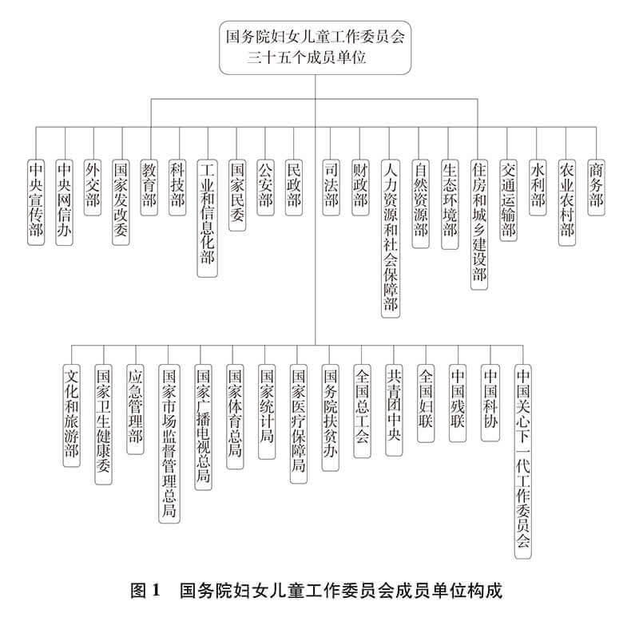
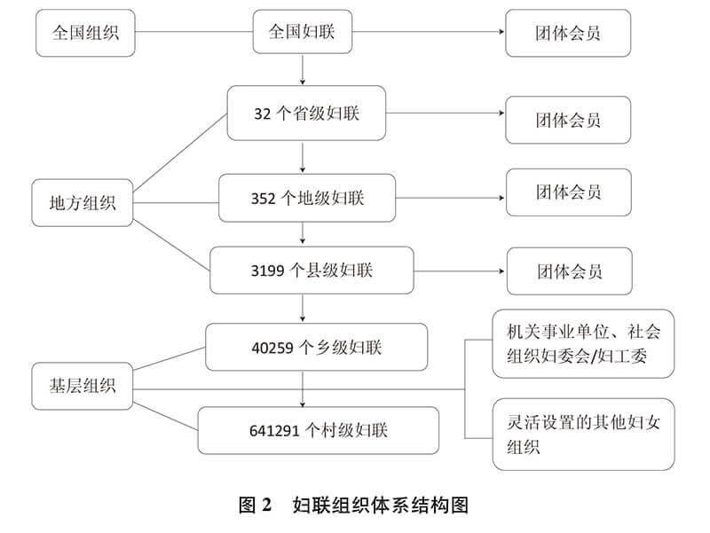
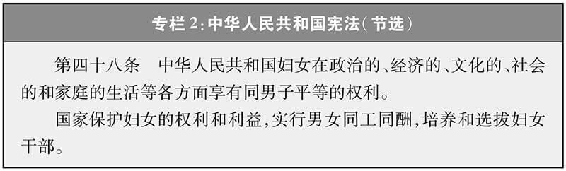
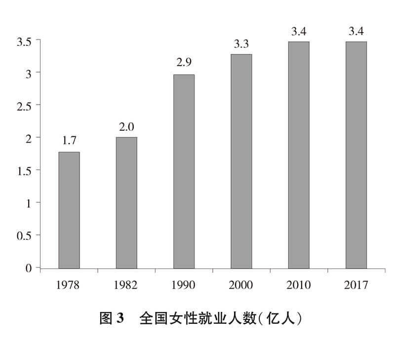
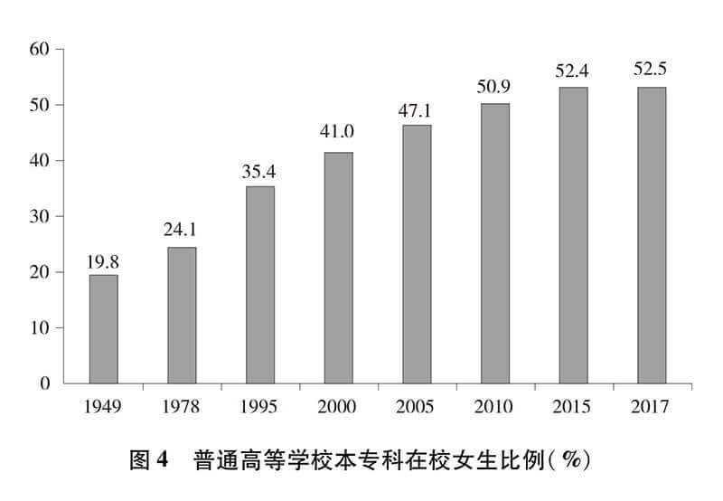
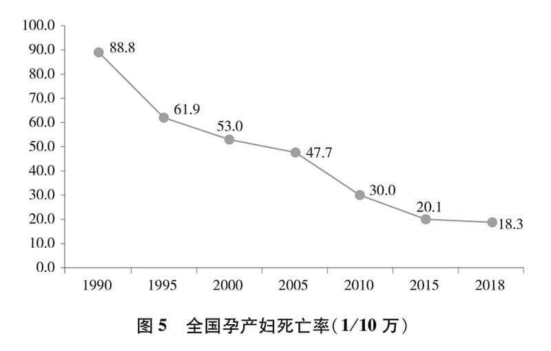
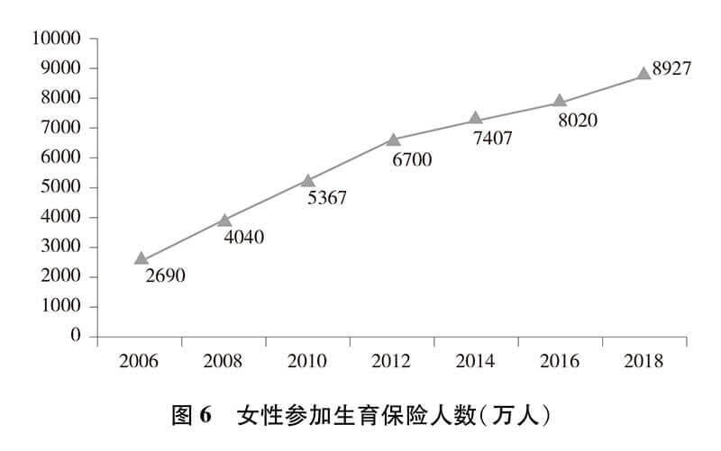
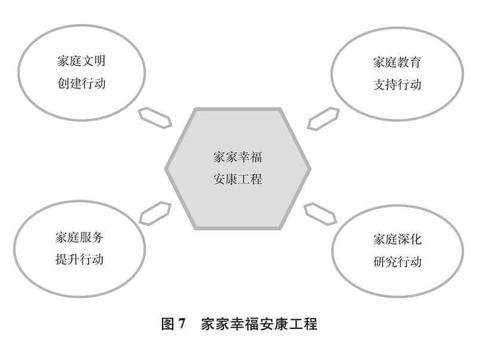

<!-- 建国后，女性权利的建设 -->
# 中国高度重视并积极推进妇女事业发展
1. 促进妇女全面发展和男女平等是中国特色社会主义的重要组成部分。
2. “坚持男女平等基本国策，保障妇女儿童合法权益”写入党的十八大、十九大报告，成为党治国理政的重要理念和内容。
3. 建立完善人大立法保障妇女权益的工作机制。
4. 建立完善政协协商推动妇女事业发展的工作机制。
5. 建立健全政府贯彻落实男女平等基本国策的工作机制。
6. 建立健全妇联组织作为党和政府联系妇女群众桥梁纽带的工作机制。

# 保障妇女权益的法治体系不断完善
1. 妇女权益是基本人权。中国把保障妇女权益纳入法律法规，上升为国家意志，内化为社会行为规范。
2. 保障妇女权益的法治宣传深入普及。将保障妇女权益的法律知识、法治精神、法治文化纳入全民普法规划。

# 妇女在经济社会发展中的半边天作用日益彰显
1. 妇女在脱贫攻坚中充分参与、广泛受益。中国高度重视妇女扶贫脱贫。
2. 保障平等土地权益调动农村妇女生产积极性。
3. 全社会就业人员中女性占比超过四成。

# 妇女政治地位显著提高
1. 中国共产党作为执政党，一贯重视培养选拔女干部、发展女党员。人大代表和政协委员中女性比例逐步提升。

# 妇女受教育水平显著提升

# 妇女健康状况极大改善

# 妇女社会保障水平不断提高

# 妇女在家庭文明建设中发挥独特作用

# 妇女参与国际交流与合作日益广泛
积极参与和承办国际会议，推动全球妇女发展。新中国成立之初，积极支持妇女组织参加国际民主妇联、举办亚洲妇女代表会议，拉开妇女外交序幕。1975年、1980年和1985年，中国代表团先后参加第一、第二、第三次世界妇女大会，参与文件制定，发出中国声音。1995年，中国承办联合国第四次世界妇女大会，提出男女平等基本国策，为形成指导全球性别平等的纲领性文件《北京宣言》和《行动纲领》作出重要贡献。2015年，在联合国成立70周年、北京世界妇女大会20周年之际，中国与联合国妇女署共同举办全球妇女峰会，140多个国家元首和政府首脑以及联合国机构、国际组织代表出席会议。中国国家主席习近平主持峰会并发表重要讲话，深刻阐述了促进男女平等和妇女全面发展的中国主张。峰会取得丰硕成果，为落实2030年可持续发展议程注入了新动力，为全球妇女事业发展树立了新的里程碑。
